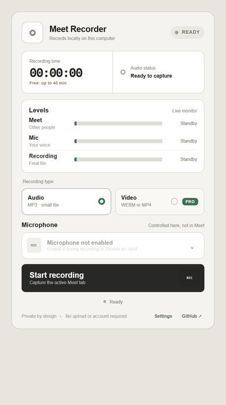
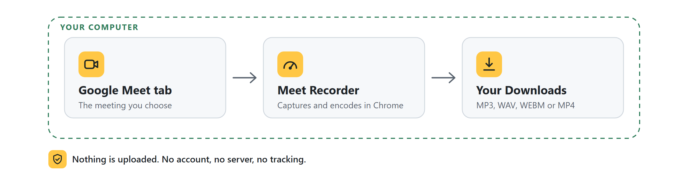

<p align="center">
  <picture>
    <source media="(prefers-color-scheme: dark)" srcset="assets/readme/banner-dark-1280x480.png">
    
  </picture>
</p>

<h1 align="center">Meet Recorder</h1>

<p align="center">
  Record audio or video from your active Google Meet tab and save it straight to your computer.<br>
  Free: MP3 audio up to 40 minutes, with your mic when you choose. Pro, one time $4.99: unlimited length, video, and more.
</p>

<p align="center">
  <a href="https://github.com/supportefy-dev/meet-recorder/releases/latest"></a>
  <a href="https://github.com/supportefy-dev/meet-recorder/releases"></a>
  
  
  <a href="LICENSE"></a>
  <a href="https://paypal.me/BashOM"></a>
</p>

<p align="center">
  <a href="https://github.com/supportefy-dev/meet-recorder/releases/latest"><strong>Download</strong></a>
  &nbsp;&middot;&nbsp;
  <a href="#quick-start">Quick start</a>
  &nbsp;&middot;&nbsp;
  <a href="PRIVACY.md">Privacy policy</a>
  &nbsp;&middot;&nbsp;
  <a href="CHANGELOG.md">Changelog</a>
  &nbsp;&middot;&nbsp;
  <a href="https://github.com/supportefy-dev/meet-recorder/issues">Report an issue</a>
</p>

<p align="center">
  
</p>

## Features

<table>
  <tr>
    <td width="33%" valign="top">
      <br>
      <strong>MP3 audio</strong><br>
      <sub>The sound of the active Meet tab as a compact MP3. Free up to 40 minutes; Pro adds 192 kbps and WAV.</sub>
    </td>
    <td width="33%" valign="top">
      <br>
      <strong>Video</strong> <sup>PRO</sup><br>
      <sub>The Meet tab's picture with mixed meeting and microphone audio, as WEBM or MP4.</sub>
    </td>
    <td width="33%" valign="top">
      <br>
      <strong>Your mic, your call</strong><br>
      <sub>Add a recording mic without touching Meet's own mute button. Pro mutes or switches it mid-recording.</sub>
    </td>
  </tr>
  <tr>
    <td width="33%" valign="top">
      <br>
      <strong>Live levels</strong><br>
      <sub>Meters for Meet, your mic, and the final file, so you know the recording hears sound.</sub>
    </td>
    <td width="33%" valign="top">
      <br>
      <strong>Private by design</strong><br>
      <sub>No account, no server, no tracking. Recordings never leave your computer.</sub>
    </td>
    <td width="33%" valign="top">
      <br>
      <strong>Straight to Downloads</strong><br>
      <sub>Click Stop and save; Chrome downloads the finished file automatically.</sub>
    </td>
  </tr>
</table>

## Free vs Pro

Pro is a one-time $4.99 purchase, paid through PayPal, with the license key emailed to your PayPal address.

**Early bird: Pro is free forever for the first 100 users.** Email bash@supportefy.com to claim your key.

| Feature | Free | Pro |
| --- | :-: | :-: |
| MP3 64 kbps audio, live meters | Yes | Yes |
| Recording mic (can be enabled, stays on for the recording) | Yes | Yes |
| Recording length | Up to 40 minutes | Unlimited |
| Video recording (WEBM or MP4) | | Yes |
| MP3 128/192 kbps and lossless WAV audio | | Yes |
| Muting the recording mic or switching devices mid-recording | | Yes |
| Separate Meet-only and mic-only files alongside the main recording | | Yes |
| Pause and resume, with the timer excluding paused time | | Yes |
| Custom file name template and a Downloads subfolder | | Yes |
| Keyboard shortcut to start or stop (default Alt+Shift+R) | | Yes |

A free recording that reaches 40 minutes is saved automatically, with a warning at 35 and 39 minutes. To activate Pro, open the extension's **Settings**, buy Pro or claim an early-bird key by email, then paste the key and click **Activate**. The key is checked offline on your computer.

## How it works

<picture>
  <source media="(prefers-color-scheme: dark)" srcset="assets/readme/how-it-works-dark.png">
  
</picture>

## Quick start

1. Download `meet-recorder-4.5.0.zip` from the [latest release](https://github.com/supportefy-dev/meet-recorder/releases/latest) and extract it.
2. Open `chrome://extensions` (in Edge, `edge://extensions`), turn on **Developer mode**, click **Load unpacked**, and select the extracted folder.
3. Open a Google Meet tab, click the extension icon, choose **Audio** (or **Video** with Pro), and click **Start recording**.
4. Click **Stop and save** when you are done. Chrome downloads the file automatically.

## Browser support

<table>
  <tr>
    <td align="center" width="14%"><br><strong>Chrome</strong></td>
    <td align="center" width="14%"><br><strong>Edge</strong></td>
    <td align="center" width="14%"><br><strong>Brave</strong></td>
    <td align="center" width="14%"><br><strong>Opera</strong></td>
    <td align="center" width="14%"><br><strong>Vivaldi</strong></td>
    <td align="center" width="14%"><br><strong>Firefox</strong></td>
    <td align="center" width="14%"><br><strong>Safari</strong></td>
  </tr>
  <tr>
    <td align="center">Supported<br><sub>116+</sub></td>
    <td align="center">Supported<br><sub>116+</sub></td>
    <td align="center">Expected<br><sub>not tested</sub></td>
    <td align="center">Expected<br><sub>not tested</sub></td>
    <td align="center">Expected<br><sub>not tested</sub></td>
    <td align="center">Not supported</td>
    <td align="center">Not supported</td>
  </tr>
</table>

- **Chrome and Edge** were tested with the extension loaded (Chrome 153, Edge 154). In Edge, install from `edge://extensions` with **Developer mode** on.
- **Brave, Opera, and Vivaldi** use the same Chromium engine and should work; they need the `tabCapture` and `offscreen` extension APIs. Please [report](https://github.com/supportefy-dev/meet-recorder/issues) what you find.
- **Firefox and Safari** cannot record a Meet tab: they have no `tabCapture` extension API and cannot capture tab audio.
- **Mobile browsers** are not supported. Chrome on Android and iOS has no extension support.

## Screenshots

<table>
  <tr>
    <td align="center" width="33%">
      <br>
      <sub><strong>Choose audio or video</strong></sub>
    </td>
    <td align="center" width="33%">
      <br>
      <sub><strong>See levels while recording</strong></sub>
    </td>
    <td align="center" width="33%">
      <br>
      <sub><strong>Choose your microphone</strong></sub>
    </td>
  </tr>
</table>

## Install

### From a release ZIP

1. Download the ZIP from the [latest GitHub release](https://github.com/supportefy-dev/meet-recorder/releases/latest), then extract it.
2. Open `chrome://extensions` in Chrome.
3. Enable **Developer mode**.
4. Click **Load unpacked**.
5. Select the extracted folder that directly contains `manifest.json`.
6. Reload your Google Meet tab, then pin **Meet Recorder** from Chrome's Extensions menu.

From 4.4.7 on, the extension keeps the same ID in every version, so loading a newer folder keeps your settings. Remove the older unpacked copy first to avoid duplicate cards.

### From source

```powershell
git clone https://github.com/supportefy-dev/meet-recorder.git
```

Then use **Load unpacked** and select the cloned repository folder.

> If another tab recorder or a Tampermonkey recorder is installed, disable it first to avoid capture conflicts.

## How recording works

1. Open the Google Meet tab you want to capture and click the extension icon.
2. Select **Audio** (or **Video** with Pro), then click **Start recording**. Meet audio starts immediately.
3. Optionally click **Enable recording mic** and approve Chrome's one-time microphone prompt.
4. Reopen the popup at any time to check the timer and live meters.
5. Click **Stop and save**. Chrome downloads the completed file automatically.

| Mode | File | Encoding |
| --- | --- | --- |
| Audio | `.mp3` | Stereo MP3, 64 kbps (Pro: 128 or 192 kbps) |
| Audio, Pro | `.wav` | 16-bit PCM, about 690 MB per hour |
| Video, Pro | `.webm` or `.mp4` | VP9/VP8 with Opus, or H.264 with AAC where Chrome supports MP4 |

Files are named with a timestamp, for example `google-meet-audio-2026-08-10T12-30-00-000Z.mp3`. Pro can change the name template and save into a Downloads subfolder.

The recording microphone is deliberately independent of Google Meet's microphone button: Meet can be muted while the extension records your mic, and Pro can mute the extension's mic or switch devices without changing Meet or interrupting its audio. Microphone permission is requested only when you enable the recording mic.

### Known limitations

- Capture starts from the active Meet tab, so start recording while that tab is in front.
- Another extension that is already capturing the tab can block or silence the recording.
- Recordings are saved through Chrome Downloads, in Chrome's download folder.

## Privacy and permissions

Recording and encoding happen inside Chrome. The extension creates a local file and hands it to Chrome's download manager; it never uploads recordings or sends them to any server. It stores only the selected microphone and recorder status in `chrome.storage.local`. Read the full [privacy policy](PRIVACY.md).

| Permission | Why it is needed |
| --- | --- |
| `activeTab` | Confirms and accesses the Meet tab you selected. |
| `tabCapture` | Captures the active Meet tab's audio and optional video. |
| `offscreen` | Keeps recording and encoding alive after the popup closes. |
| `downloads` | Saves the completed MP3 or WEBM file locally. |
| `storage` | Remembers recorder status and the selected microphone. |

Always obtain consent from meeting participants and follow the recording laws and workplace policies that apply to you.

## Troubleshooting

### Meet audio is silent

- Start the recording while the Google Meet tab is active.
- Confirm the Meet tab itself is producing sound.
- Stop other tab-recording extensions that may already own the capture stream.

### Microphone is unavailable

- Click **Enable recording mic** and allow access on the permission page.
- Check Chrome's microphone permission for the extension.
- Choose another device from the extension's microphone list.

### Chrome still shows an old icon or interface

Open `chrome://extensions`, click **Reload** on the extension card, then reload the Meet tab.

Still stuck? [Open an issue](https://github.com/supportefy-dev/meet-recorder/issues) with your Chrome version and the steps that fail.

## Development

The project uses plain HTML, CSS, and JavaScript with no build step.

| Path | Holds |
| --- | --- |
| `manifest.json` | Manifest V3 extension definition |
| `popup.*` | Recorder interface and controls |
| `mic-permission.*` | One-time microphone permission screen |
| `offscreen.*` | Capture, mixing, metering, and encoding engine |
| `service-worker.js` | Recorder lifecycle, state, and downloads |
| `icons/`, `vendor/` | Extension icons; bundled MP3 encoder and its license |
| `assets/media-pack/` | Store screenshots, promo tiles, README banner, social preview, and their editable SVGs |
| `assets/readme/`, `tools/readme-media/` | README artwork (icons, dark banner, diagram, demo GIF) and the scripts that rebuild it |

Before loading or submitting a change, validate the scripts and manifest:

```powershell
node --check popup.js
node --check mic-permission.js
node --check offscreen.js
node --check service-worker.js
Get-Content -Raw manifest.json | ConvertFrom-Json | Out-Null
```

After changing capture behavior, test Audio and Video on a real Meet tab, including mic enable, mute, device switching, popup reopen, and playback of the downloaded file. Issues and focused pull requests are welcome; read [`CONTRIBUTING.md`](CONTRIBUTING.md) first.

## License

Copyright (c) 2026 Supportefy LLC. All rights reserved. The source is public so you can see exactly what the extension does; it is not licensed for reuse or redistribution.

MP3 encoding uses the bundled [`@breezystack/lamejs`](https://www.npmjs.com/package/@breezystack/lamejs) encoder under its own LGPL-3.0 license, included at [`vendor/lamejs.LICENSE`](vendor/lamejs.LICENSE).

## Support development

Meet Recorder's free tier needs no purchase. If it is useful to you, you can [make a one-time donation on PayPal](https://paypal.me/BashOM), separately from a Pro purchase; donations do not unlock features.

You can also help by [reporting a bug](https://github.com/supportefy-dev/meet-recorder/issues) or sharing the project.
