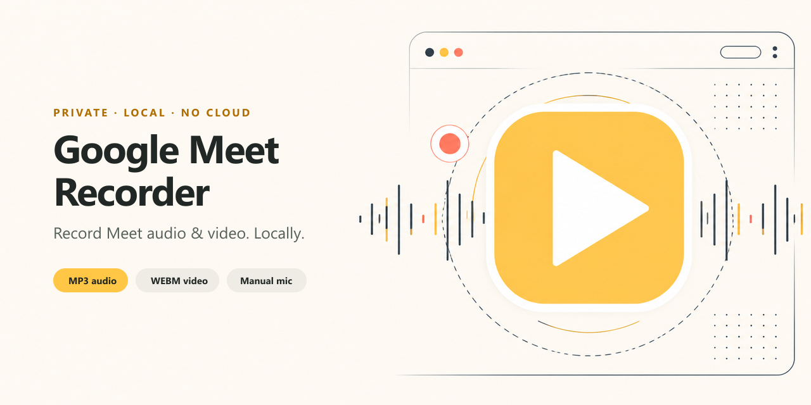
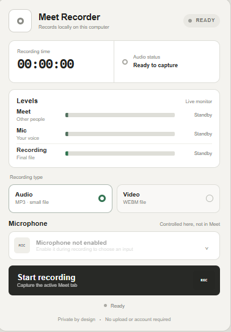
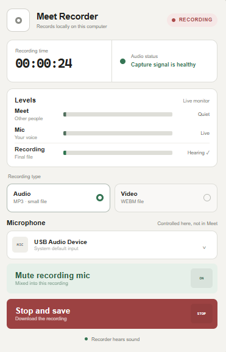
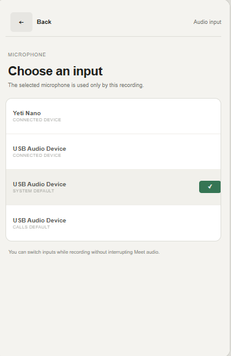
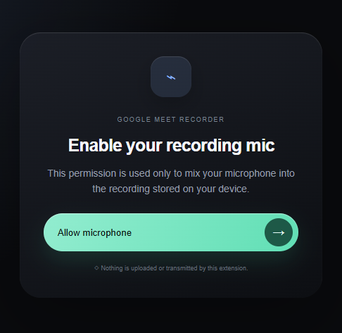

<p align="center">
  
</p>

<h1 align="center">Google Meet Recorder</h1>

<p align="center">
  A privacy-first Chrome extension for recording Google Meet audio or video directly on your computer.
</p>

<p align="center">
  
  
  
  
</p>

## Highlights

- **Meet audio recording** — captures the audio you hear from the active Google Meet tab.
- **Compact MP3 output** — audio-only sessions are encoded locally at 64 kbps.
- **Video with mixed audio** — records the active Meet tab to WEBM with tab audio and optional microphone input.
- **Independent microphone controls** — enable, mute, unmute, and switch recording microphones without following Meet's mute state.
- **Live signal meters** — monitor Meet, microphone, and final recording levels while capturing.
- **Private by design** — no account, server, telemetry, or cloud upload is used by the extension.

## Interface

<table>
  <tr>
    <td align="center" width="50%">
      <br>
      <sub><strong>Ready to record</strong> — choose audio or video and review input levels.</sub>
    </td>
    <td align="center" width="50%">
      <br>
      <sub><strong>Live recording</strong> — monitor signal health and control the microphone independently.</sub>
    </td>
  </tr>
  <tr>
    <td align="center" width="50%">
      <br>
      <sub><strong>Microphone selection</strong> — switch inputs without interrupting Meet audio.</sub>
    </td>
    <td align="center" width="50%">
      <br>
      <sub><strong>One-time permission</strong> — microphone access is requested only when enabled.</sub>
    </td>
  </tr>
</table>

## Requirements

- Google Chrome 116 or newer.
- A Google Meet tab open at `https://meet.google.com/`.
- Developer mode enabled in Chrome while installing the unpacked extension.

## Install

### From a downloaded ZIP

1. Download the extension ZIP from the [latest GitHub Release](https://github.com/supportefy-dev/google-meet-recorder-extension/releases/latest), then extract it.
2. Open `chrome://extensions` in Chrome.
3. Enable **Developer mode**.
4. Click **Load unpacked**.
5. Select the extracted extension folder that directly contains `manifest.json`.
6. Reload your Google Meet tab, then pin **Google Meet Recorder** from Chrome's Extensions menu.

### From source

```powershell
git clone https://github.com/supportefy-dev/google-meet-recorder-extension.git
```

Then use **Load unpacked** and select the cloned repository folder.

> If an older version or Tampermonkey recorder is installed, disable it first to avoid duplicate controls and capture conflicts.

## Record a meeting

1. Open the Google Meet tab you want to capture.
2. Click the extension icon.
3. Select **Audio** or **Video**.
4. Click **Start recording**. Meet audio starts immediately.
5. Optionally click **Enable recording mic** and approve Chrome's one-time microphone prompt.
6. Control or switch the recording microphone from the extension whenever needed.
7. Reopen the popup at any time to check the timer and live signal meters.
8. Click **Stop & save**. Chrome downloads the completed file automatically.

## Output formats

| Mode | File | Encoding |
| --- | --- | --- |
| Audio | `.mp3` | Stereo MP3, 64 kbps |
| Video | `.webm` | Chrome-supported VP9/VP8 video with Opus audio |

Files are named with an ISO-style timestamp, for example `google-meet-audio-2026-08-10T12-30-00-000Z.mp3`.

## Microphone behavior

The recording microphone is deliberately independent of Google Meet's microphone button:

- Meet can be muted while the extension records your microphone.
- The extension can mute its microphone track without changing Meet.
- Switching devices does not interrupt Meet audio capture.
- Microphone permission is requested only when you explicitly enable recording microphone input.

## Privacy

Recording and encoding happen inside Chrome. The extension creates a local object URL and passes it to Chrome's download manager; it does not upload recordings or send them to an external service.

The extension stores only operational preferences and recorder state in `chrome.storage.local`, such as the selected microphone and current session status.

Always obtain consent from meeting participants and follow the recording laws and workplace policies that apply to you.

## Permissions

| Permission | Why it is needed |
| --- | --- |
| `activeTab` | Confirms and accesses the Meet tab selected by the user. |
| `tabCapture` | Captures the active Meet tab's audio and optional video. |
| `offscreen` | Keeps recording and encoding alive after the popup closes. |
| `downloads` | Saves the completed MP3 or WEBM file locally. |
| `storage` | Persists recorder status and the selected microphone. |

## Project structure

```text
├── assets/                 Repository artwork and product screenshots
├── icons/                  Chrome toolbar and extension icons
├── vendor/                 Locally bundled MP3 encoder and license
├── manifest.json           Manifest V3 extension definition
├── popup.*                 Recorder interface and controls
├── mic-permission.*        One-time microphone permission screen
├── offscreen.*             Capture, mixing, metering, and encoding engine
└── service-worker.js       Recorder lifecycle, state, and downloads
```

## Development checks

The project uses plain HTML, CSS, and JavaScript and has no build step. Before loading or submitting a change, validate the scripts and manifest:

```powershell
node --check popup.js
node --check mic-permission.js
node --check offscreen.js
node --check service-worker.js
Get-Content -Raw manifest.json | ConvertFrom-Json | Out-Null
```

After changing capture behavior, test both Audio and Video modes on a real Meet tab, including microphone enable, mute, device switching, and final playback.

## Troubleshooting

### Meet audio is silent

- Start the recording while the Google Meet tab is active.
- Confirm the Meet tab itself is producing sound.
- Stop other tab-recording extensions that may already own the capture stream.

### Microphone is unavailable

- Click **Enable recording mic** and allow access on the permission page.
- Check Chrome's microphone permission for the extension.
- Choose another device from the extension's microphone list.

### Chrome still shows an old icon or interface

Open `chrome://extensions`, click **Reload** on the extension card, then reload the Meet tab. When moving between versioned folders, remove the older unpacked version first.

## Third-party software

MP3 encoding uses the locally bundled [`@breezystack/lamejs`](https://www.npmjs.com/package/@breezystack/lamejs) encoder. Its LGPL-3.0 license is included at [`vendor/lamejs.LICENSE`](vendor/lamejs.LICENSE).

## Contributing

Issues and focused pull requests are welcome. Read [`CONTRIBUTING.md`](CONTRIBUTING.md) before submitting changes. Keep changes local-first, avoid adding network services or telemetry, and include manual verification notes for recording changes.
